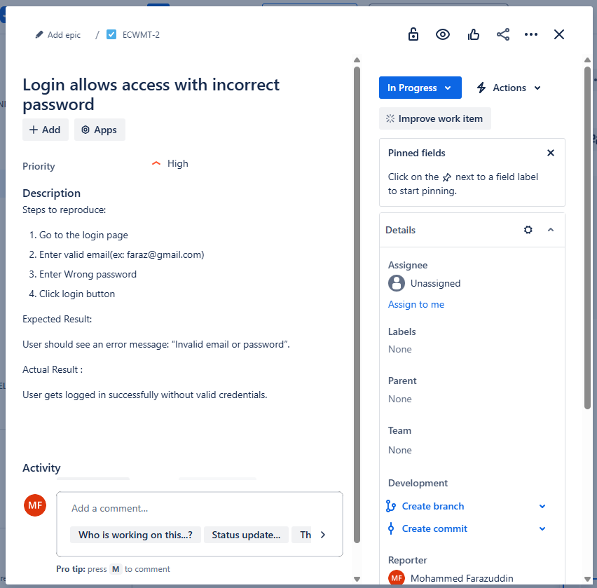
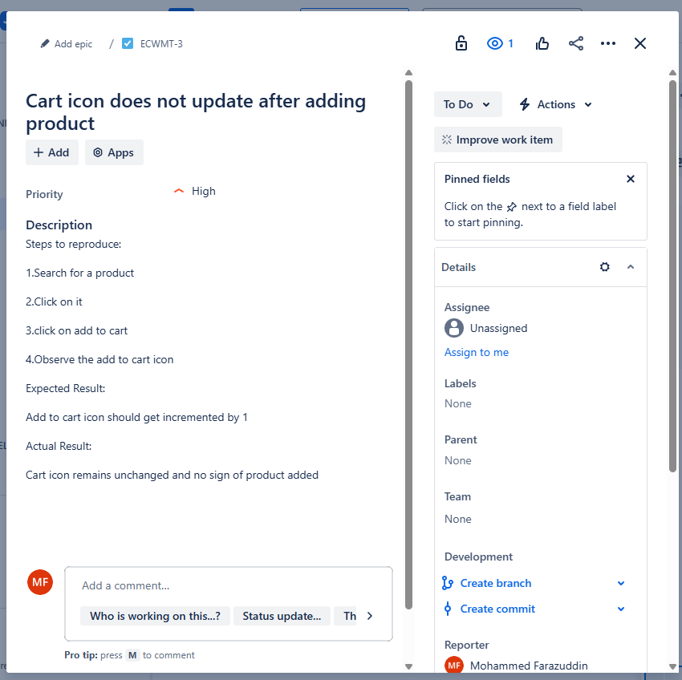

Amazon Manual Testing Project (Mock)

This project demonstrates manual testing of a sample e-commerce website (Amazon clone) focusing on core user functionalities. It includes test cases, bug reports, and testing documentation using real-world QA processes.

---

 Project Overview

- **Domain:** E-commerce Web Application  
- **Tested Features:** Login, Product Search, Add to Cart  
- **Testing Type:** Manual Functional Testing  
- **Techniques Used:** STLC, Boundary Value Analysis, Equivalence Partitioning  
- **Tools Used:** Excel (Test Case Design)
                  Jira(Bug Reporting & Tracking)
---
---

 Bug Tracking (Jira)

Bugs were reported and tracked using **Jira**.  
Here are two examples with steps, priorities, and actual vs expected outcomes.

- Login allows access with incorrect password  
  

- Cart icon does not update after adding product  
  

 Project Structure

| Folder / File                | Description                                       |
|-----------------------------|---------------------------------------------------|
| `TestCases/`                | Excel file with 5+ manual test cases              |
| `BugReports/`               | Excel bug report with 3 identified issues         |
| `Screenshots/`              | Jira bug report screenshots (Login & Cart issues) |
| `Amazon_Bug_Report.xlsx`    | Final consolidated bug report (downloadable)      |
| `README.md`                 | Project summary and documentation                 |

---

 Test Case Highlights

- Valid and invalid login credentials  
- Search functionality with relevant and irrelevant keywords  
- Add to Cart – cart icon updates, product added confirmation  
- Negative test cases for form validation

---

 Bug Report Highlights

| Bug ID          | Module       | Summary                                        | Severity | Priority |
|-----------------|--------------|------------------------------------------------|----------|----------|
| BUG_AMAZON_001  | Search       | Irrelevant search results                      | Medium   | High     |
| BUG_AMAZON_002  | Add to Cart  | Cart icon doesn't update after adding product | Medium   | High     |
| BUG_AMAZON_003  | Login        | Blank password not validated                   | High     | High     |

---

 Key Learnings

- Practical application of test case design techniques  
- Realistic bug reporting and tracking with severity/priority  
- End-to-end test planning and documentation flow  
- Exposure to functional testing in an e-commerce domain

---

 Note

This is a mock manual testing project created as part of QA training for interview preparation and portfolio building.
